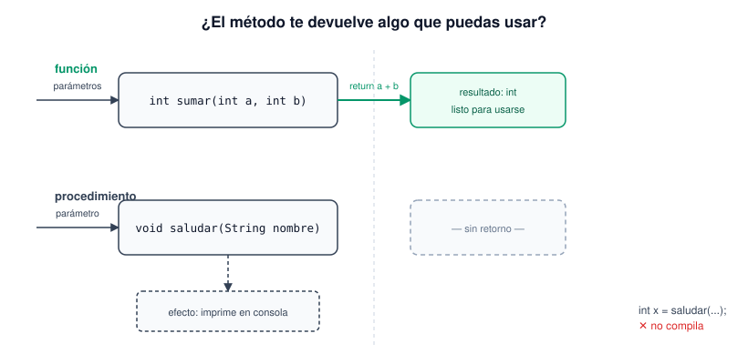

# Procedimientos

Un procedimiento es lo mismo que una función pero sin `return` — en Java se escribe con `void` como tipo de retorno. Hace algo (imprime, cambia el estado de un objeto, guarda un archivo), pero no entrega ningún valor de vuelta para usar en una expresión.

```java
static void saludar(String nombre) {
    System.out.println("Hola, " + nombre + "!");
}
```

La prueba rápida para saber si algo debería ser función o procedimiento: lo que hace este método, ¿se va a necesitar usar después en otra parte del código (`int total = sumar(2, 3)`)? Entonces es función. ¿Solo hace falta que haga algo y ya? Entonces `void`, procedimiento.

Vale la pena mostrar por qué esto no compila:

```java
int resultado = imprimirTabla(7); // ERROR — imprimirTabla es void, no devuelve nada
```

No es un capricho del lenguaje: si el método no calculó ni empaquetó ningún valor de retorno, no hay nada que asignarle a `resultado`.



Ejemplo completo en [`Procedimientos.java`](Procedimientos.java), con un saludo y una tabla de multiplicar impresa por consola.
