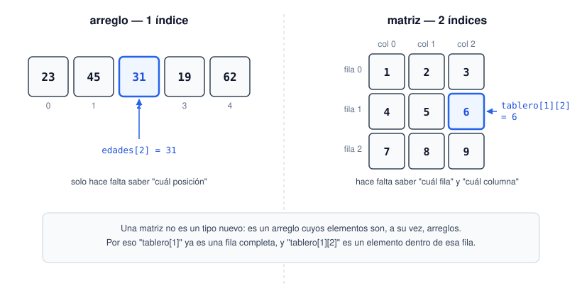

# Matrices

Una matriz en Java no es más que un arreglo de arreglos: un arreglo cuyos elementos son, a su vez, otros arreglos. Se accede con dos índices en vez de uno: `matriz[fila][columna]`. El siguiente diagrama lo pone lado a lado con el arreglo normal, para que quede claro que es la misma idea con un nivel más de anidamiento, no algo completamente nuevo.



```java
int[][] tablero = {
    {1, 2, 3},
    {4, 5, 6},
    {7, 8, 9}
};
System.out.println(tablero[1][2]); // 6 — fila 1, columna 2
```

Para recorrerla completa hacen falta dos ciclos anidados: uno para las filas y otro, adentro, para las columnas.

```java
for (int fila = 0; fila < tablero.length; fila++) {
    for (int columna = 0; columna < tablero[fila].length; columna++) {
        System.out.print(tablero[fila][columna] + " ");
    }
    System.out.println();
}
```

Fíjense que uso `tablero[fila].length` y no `tablero[0].length` para el límite de columnas — en Java, técnicamente, cada fila es su propio arreglo independiente y no está obligada a tener el mismo tamaño que las demás (a eso se le llama *arreglo irregular* o *jagged array*). Más abajo hay un ejemplo de esto a propósito.

## Formas de declarar una matriz

Las mismas ideas de `07-arreglos/README.md` aplican acá, solo que con un nivel más de anidamiento:

```java
// 1. Tamaño fijo, todo relleno con el valor por defecto (0 para int)
int[][] a = new int[3][3];

// 2. Literal corto, solo funciona en la misma línea de la declaración
int[][] b = {{1, 2}, {3, 4}};

// 3. Forma "new" explícita, válida en cualquier lado
int[][] c;
c = new int[][]{{1, 2}, {3, 4}};

// 4. Matriz irregular (jagged): se reserva solo el número de filas,
//    y cada fila se crea aparte, con el tamaño que necesite
int[][] d = new int[3][]; // 3 filas, todavía en null
d[0] = new int[2];
d[1] = new int[4];
d[2] = new int[1];
```

La forma 4 es la que conecta directo con el párrafo anterior: como cada fila es, en el fondo, su propio arreglo, se puede armar una matriz donde cada fila tenga un tamaño distinto. Sirve, por ejemplo, para representar un triángulo de datos sin desperdiciar espacio con celdas que nunca se van a usar.

Ejemplo completo en [`Matrices.java`](Matrices.java), con una matriz fija y otra creada vacía y llenada con un cálculo.
