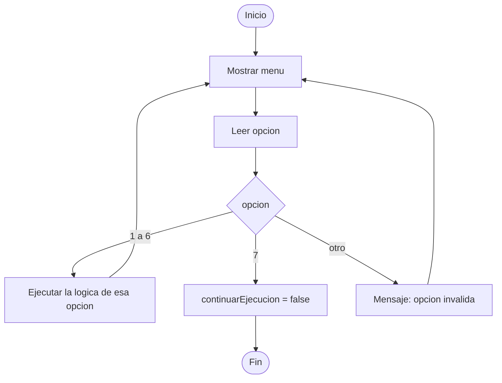

# 00. Construyendo el menú

Todo el Sistema de Estacionamiento gira alrededor de un menú que se repite hasta que el usuario decide
salir. Antes de programar "ingresar vehículo" o "calcular ruta", hace falta el esqueleto que va a llamar a
cada una de esas partes. Eso es lo que se construye en este módulo.

Corresponde a la sección **2.1 Inicialización, entrada/salida y menú** de la rúbrica de `Practica1.pdf`
(el menú debe mantenerse operativo con sus 7 opciones) y a la base de **1.2 Calidad de código**, porque un
`main` ordenado empieza por tener un ciclo y un `switch` claros, no un montón de `if` sueltos.

## El flujo del menú



## Los tres conceptos que se combinan

### 1. Variables para controlar el flujo

No todas las variables guardan "datos del negocio" (una placa, una fila). Algunas existen solo para
controlar qué hace el programa — se llaman **variables de control** o **banderas**:

```java
boolean continuarEjecucion = true;
```

Esta variable no representa nada del estacionamiento; representa una decisión: "¿debo seguir mostrando el
menú?". Se declara antes del ciclo, empieza en `true`, y en algún punto adentro del ciclo cambia a `false`.
Ese cambio es lo único que hace que el ciclo termine.

### 2. Un ciclo `do-while` para repetir el menú

```java
do {
    // mostrar el menú, leer la opción, ejecutar el switch
} while (continuarEjecucion);
```

La diferencia clave frente a un `while` normal: en un `do-while` el bloque se ejecuta **primero** y la
condición se revisa **después**, al final. Eso importa acá porque el menú tiene que aparecer sí o sí la
primera vez — no hay ninguna condición previa que valga la pena revisar antes de mostrarlo por primera vez.
Si usaras un `while (continuarEjecucion)` normal el resultado sería el mismo en este caso puntual (porque
la variable arranca en `true`), pero el `do-while` comunica mejor la intención: "esto se ejecuta al menos
una vez, siempre".

### 3. `switch` para despachar cada opción

```java
switch (opcion) {
    case 1:
        // lógica de esa opción
        break;
    case 7:
        continuarEjecucion = false;
        break;
    default:
        System.out.println("Opción inválida.");
}
```

Cada `case` es una puerta distinta. El `break` es obligatorio al final de cada una: sin él, la ejecución
"cae" al siguiente `case` aunque no haya coincidido (esto se llama *fall-through* y casi siempre es un
error, no algo intencional). El `default` es el que atrapa cualquier número que no sea una opción válida
del menú (0, -3, 8, 999...) — sin `default`, esos casos simplemente no hacen nada, y el usuario se queda
sin saber si el programa funcionó o no.

## El punto de salida vive dentro del switch

Fijate que `continuarEjecucion = false;` no está antes ni después del `do-while` — está **dentro** del
`case 7`. Es la única línea de todo el programa que apaga la bandera, y es intencional: la decisión de
"salir" solo la puede tomar el usuario, eligiendo esa opción, no cualquier otro punto del código.

## Errores típicos

- Olvidar el `break` en un `case` y que la ejecución siga al siguiente sin querer.
- Usar `while` en vez de `do-while` y agregar un truco raro para forzar la primera iteración — el
  `do-while` existe justamente para evitar ese truco.
- No tener `default`: el programa "no responde" ante una opción fuera de rango en vez de avisar.
- Leer con `teclado.nextInt()` cuando el usuario escribió texto: el programa se cae con
  `InputMismatchException`. Este módulo no lo cubre (queda para cuando trabajen validación de entradas en
  otros módulos), pero es bueno tenerlo presente.

## Ejemplo ejecutable

[`MenuPrincipal.java`](src/main/java/gt/edu/usac/ipc1/menu/MenuPrincipal.java) reproduce las 7 opciones
reales del enunciado, pero cada `case` solo imprime un mensaje de marcador de posición — la lógica real de
cada opción se construye en los módulos siguientes y se conecta acá.

### Cómo correrlo en NetBeans

1. `File > Open Project…` y seleccioná la carpeta `00_construyendo_el_menu` (NetBeans reconoce el
   `pom.xml` automáticamente y la muestra como proyecto Maven).
2. Abrí `MenuPrincipal.java` y presioná `Shift+F6` (Run File) para ejecutarlo directamente.
3. También podés generar el `.jar` ejecutable con `mvn package` (o el botón "Build" de NetBeans), igual
   que va a pedir la entrega final de la práctica.

Este ejemplo es el esqueleto, no la solución. La idea es que reemplaces cada mensaje de marcador de
posición con las llamadas a tus propios métodos a medida que avances por el resto de la guía.
