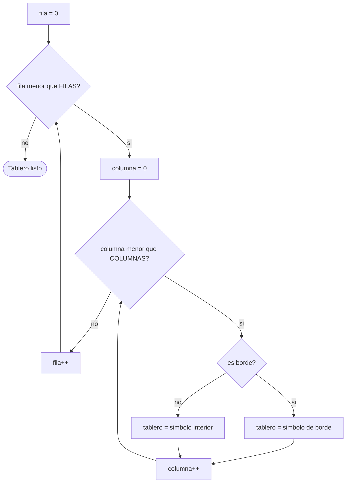

# 01. Arreglos bidimensionales del tablero

El estacionamiento es, ni más ni menos, una cuadrícula: filas y columnas donde cada casilla guarda un
estado (libre, ocupado, entrada, salida, vía exterior). En Java esa cuadrícula se representa con un
**arreglo bidimensional**, y este módulo cubre cómo declararlo, llenarlo y recorrerlo correctamente.

Corresponde a la sección **2.4 Visualización del estacionamiento** de la rúbrica (tablero con filas,
columnas y estados correctos) y al requisito técnico de usar **únicamente arreglos nativos** — nada de
`ArrayList` ni colecciones dinámicas.

## El recorrido, como diagrama de flujo



## Declarar un arreglo bidimensional

```java
char[][] tablero = new char[FILAS][COLUMNAS];
```

En Java, un arreglo 2D es en realidad un **arreglo de arreglos**: `tablero` tiene `FILAS` posiciones, y
cada una de esas posiciones es a su vez un arreglo de `COLUMNAS` elementos. Por eso se accede con dos
índices: `tablero[fila][columna]` — primero la fila, después la columna. Confundir el orden es un error
muy común y no siempre truena de inmediato si el tablero es cuadrado (mismo número de filas que de
columnas), así que hay que ser deliberado con el orden.

## Constantes para el tamaño

```java
static final int FILAS = 6;
static final int COLUMNAS = 6;
```

`static final` significa "una sola copia, y no puede cambiar después de asignada". El tamaño del tablero
no cambia mientras el programa corre, así que tratarlo como variable común sería engañoso — además, usar
`FILAS` y `COLUMNAS` en vez de escribir `6` a cada rato dentro del código hace que, si en tu versión el
tamaño es distinto, solo tengas que cambiar un lugar.

## Recorrido anidado: por qué el orden de los ciclos importa

```java
for (int fila = 0; fila < FILAS; fila++) {
    for (int columna = 0; columna < COLUMNAS; columna++) {
        // trabajar con tablero[fila][columna]
    }
}
```

El ciclo de afuera mueve la fila; el de adentro recorre esa fila completa, columna por columna, antes de
pasar a la siguiente fila. Si invertís cuál ciclo va afuera y cuál adentro, el tablero se recorre "rotado"
— para imprimirlo en el orden natural (fila por fila, de arriba hacia abajo) el orden de este ejemplo es
el que hay que respetar.

## Distinguir borde de área interna

```java
boolean esBorde = fila == 0 || fila == FILAS - 1
        || columna == 0 || columna == COLUMNAS - 1;
```

Una posición es borde si está en la primera o última fila, **o** en la primera o última columna. Esta
condición es la misma idea que necesitás para la vía exterior del tablero real de 10x10: todo lo que no
sea borde es área interna (ahí es donde van los 64 espacios de estacionamiento).

Ojo con el `FILAS - 1`: los índices válidos van de `0` a `FILAS - 1`, nunca hasta `FILAS`. Escribir
`fila == FILAS` en vez de `fila == FILAS - 1` es la fuente más común de un `ArrayIndexOutOfBoundsException`
en este tipo de recorridos.

## Ejemplo ejecutable

[`TableroDemo.java`](src/main/java/gt/edu/usac/ipc1/tablero/TableroDemo.java) construye un tablero 6x6 de
ejemplo (más chico que el de 10x10 del enunciado, a propósito) con `=` en el borde y `L` en el área
interna, dividido en dos métodos (`llenarTablero` y `imprimirTablero`) que reciben el arreglo como
parámetro — como los arreglos se pasan por referencia, los cambios que hace `llenarTablero` se reflejan
directamente en el arreglo creado en `main`, sin necesidad de devolverlo.

### Cómo correrlo en NetBeans

1. `File > Open Project…` sobre la carpeta `01_arreglos_bidimensionales_del_tablero`.
2. Abrí `TableroDemo.java` y `Shift+F6` para correrlo.

Este ejemplo enseña el patrón sobre un tablero genérico y reducido — adaptalo a los 10x10 reales
(con entrada, salida y los 64 espacios internos) como parte de tu propia solución.
