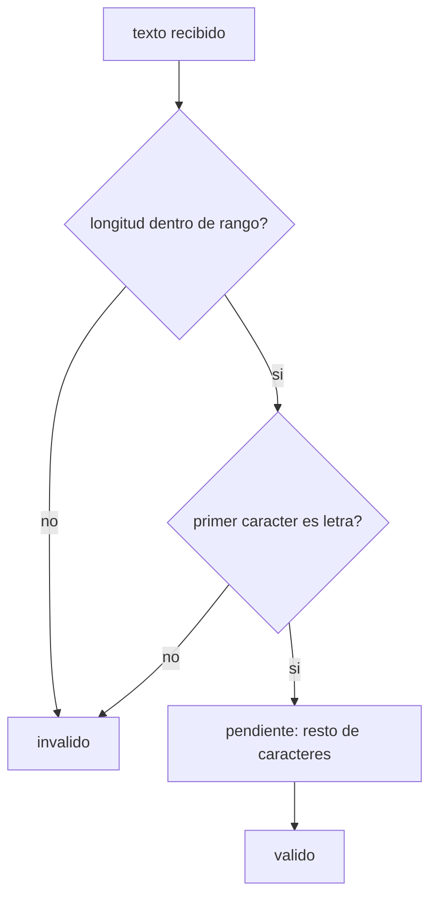

# 02. Comparación de cadenas y validaciones

Cualquier dato que entra por teclado (una placa, un código, un nombre) puede venir mal escrito. Antes de
usarlo hay que confirmar que cumple un formato — y eso casi siempre significa revisar el texto carácter
por carácter con `String` y `Character`, combinando varias condiciones a la vez.

Se relaciona con la sección **2.2 Ingreso de vehículo, pago y cambio** de la rúbrica (*"Valida el formato
P###LLL..."*), aunque el ejemplo de este módulo usa un dominio distinto (un nombre de usuario genérico) a
propósito: la técnica es la misma, pero el objetivo es que entiendas el patrón, no que copies una
validación ya resuelta para la placa.

## El proceso de validación



## `String` se comporta como una secuencia indexada

```java
texto.length()     // cantidad de caracteres
texto.charAt(i)     // caracter en la posicion i, empezando en 0
```

`charAt` funciona con la misma lógica de índices que un arreglo, incluyendo el mismo riesgo: pedir una
posición que no existe lanza una excepción. Por eso conviene revisar la longitud **antes** de acceder a
posiciones específicas.

## `Character` para clasificar, en vez de comparar rangos a mano

```java
Character.isLetter(c)
Character.isDigit(c)
Character.isUpperCase(c)
```

Son métodos estáticos de la clase `Character` (se llaman como `Character.algo(...)`, no `c.algo()`) y
evitan escribir comparaciones como `c >= 'a' && c <= 'z'`.

## Lo que este ejemplo deja pendiente

[`ValidacionDeFormato.java`](src/main/java/gt/edu/usac/ipc1/texto/ValidacionDeFormato.java) solo
implementa dos reglas (longitud dentro de un rango, y que el primer carácter sea una letra) sobre un
arreglo de nombres de usuario de prueba. La validación de que **el resto de los caracteres** sean letras o
dígitos válidos queda como ejercicio — el comentario dentro del método indica dónde y con qué herramientas
(`Character.isDigit`, `Character.isUpperCase`, un ciclo sobre un rango de posiciones) se construye esa
parte, siguiendo la misma idea que ya viste para la longitud y el primer carácter.

Para el formato `P###LLL` de la práctica real vas a necesitar exactamente ese tipo de ciclo, revisando
posiciones distintas con reglas distintas (unas dígitos, otras letras mayúsculas).

### Cómo correrlo en NetBeans

1. `File > Open Project…` sobre la carpeta `02_comparacion_de_cadenas_y_validaciones`.
2. Abrí `ValidacionDeFormato.java` y `Shift+F6`.
