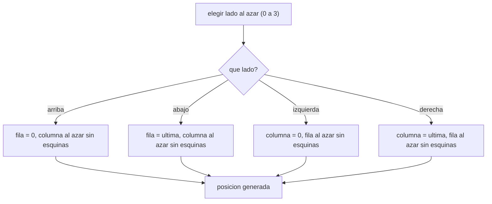

# 03. Generación aleatoria

Varias partes del sistema no reciben su valor por teclado, sino que el programa lo decide al azar (por
ejemplo, dónde aparece la entrada del estacionamiento). Este módulo cubre la base de `Random`: generar un
número dentro de un rango, y aplicarlo para ubicar una posición sobre el borde de una cuadrícula sin caer
en una esquina.

Se relaciona con la sección **2.1 Inicialización, entrada/salida y menú** de la rúbrica y con el requisito
técnico de usar `Random` para la generación de posiciones sobre el perímetro.

## Elegir un lado, luego generar la coordenada que falta



## `Random`: números al azar dentro de un rango

```java
Random rnd = new Random();
int numero = rnd.nextInt(4); // entero entre 0 (inclusive) y 4 (exclusive)
```

Si el rango que necesitás no arranca en `0`, se suma un desplazamiento después:
`minimo + rnd.nextInt(cantidadDeValores)`. Esa fórmula es la que vas a reutilizar en cualquier parte del
programa donde necesites un número aleatorio dentro de un rango específico.

## Por qué elegir el lado primero

Generar una posición cualquiera y después verificar si cayó en el borde sería más complicado de lo
necesario. Eligiendo primero el lado (arriba, abajo, izquierda o derecha), una de las dos coordenadas ya
queda fija, y solo hace falta generar la otra dentro de un rango que, por construcción, excluye las
esquinas.

## Devolver una posición con un arreglo de tamaño 2

```java
return new int[]{fila, columna};
```

Java no permite que un método devuelva dos valores por separado. Como el enunciado exige arreglos nativos,
la forma más simple de devolver una pareja `(fila, columna)` es empaquetarla en un arreglo de dos
posiciones: `[0]` es la fila, `[1]` es la columna.

## Lo que este ejemplo deja pendiente

[`GeneracionAleatoria.java`](src/main/java/gt/edu/usac/ipc1/aleatorio/GeneracionAleatoria.java) genera
**una sola** posición sobre el borde (pensala como la entrada). Generar la salida y garantizar que no
coincida con la entrada queda como ejercicio: la idea es llamar de nuevo al mismo método y, mientras el
resultado coincida con la entrada, volver a generarlo — el mismo patrón de "generar de nuevo mientras no
se cumpla una condición" que vas a necesitar más adelante para evitar placas duplicadas o espacios ya
ocupados.

### Cómo correrlo en NetBeans

1. `File > Open Project…` sobre la carpeta `03_generacion_aleatoria`.
2. Abrí `GeneracionAleatoria.java` y `Shift+F6` — corré varias veces para ver que la posición cambia en
   cada ejecución.
