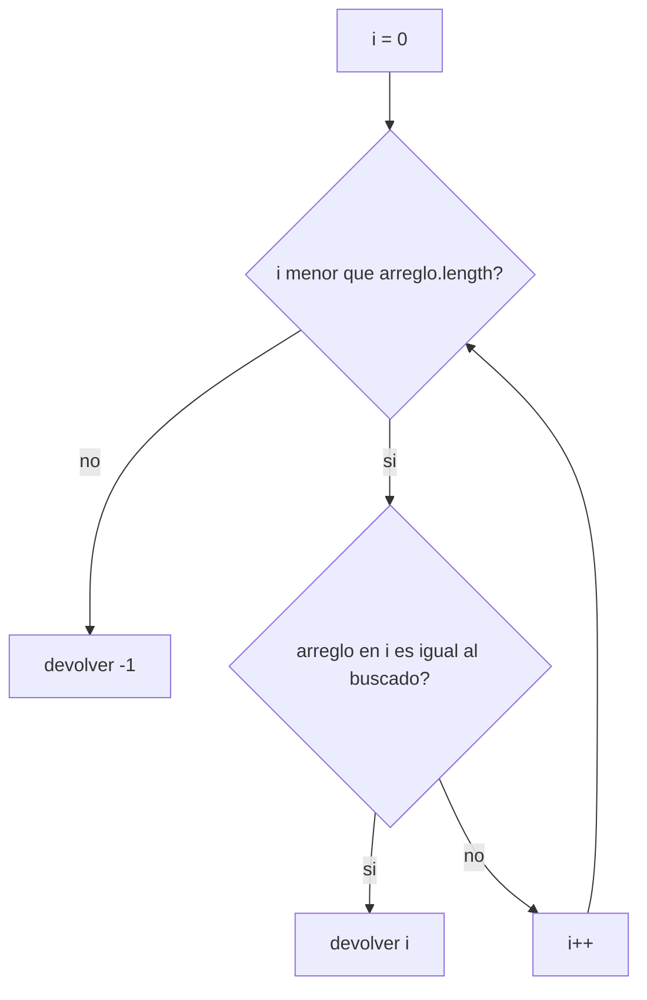

# 04. Búsqueda en arreglos

"Buscar vehículo por placa" y "retirar vehículo" son, en el fondo, el mismo problema: recorrer un arreglo
buscando una coincidencia. Este módulo aísla ese patrón — búsqueda lineal — para que lo reutilices en
ambas opciones del menú (y también para validar que una placa no esté duplicada antes de ingresarla).

Corresponde a las secciones **2.3 Retiro de vehículo** y **2.5 Búsqueda por placa** de la rúbrica: ambas
dependen de "recorrer todo el arreglo" e "informar adecuadamente cuando no existe".

## El patrón de búsqueda lineal



```java
static int buscarPosicion(String[] codigos, String buscado) {
    for (int i = 0; i < codigos.length; i++) {
        if (codigos[i].equals(buscado)) {
            return i;
        }
    }
    return -1;
}
```

Tres ideas sostienen este patrón:

1. **Recorrer todo, en orden, hasta encontrar o terminar.** No hay atajos: en un arreglo nativo sin
   ordenar, la única forma de saber si algo está ahí es revisar posición por posición.
2. **`return` corta el ciclo apenas encuentra la coincidencia.** No hace falta seguir recorriendo el resto
   del arreglo una vez que ya se encontró lo que se buscaba — devolver el valor desde adentro del `for`
   termina el método de inmediato.
3. **`-1` como señal de "no encontrado".** Nunca es un índice válido de un arreglo (los índices siempre
   son `0` o mayores), así que sirve como un valor imposible de confundir con un resultado real. Quien
   llama al método siempre debe revisar si el resultado es `-1` antes de usarlo como índice.

## `.equals()`, no `==`, para comparar `String`

```java
if (codigos[i].equals(buscado)) { ... }
```

`==` entre dos `String` compara si son **el mismo objeto en memoria**, no si tienen el mismo contenido. Dos
`String` pueden tener exactamente el mismo texto y `==` decir `false` de todas formas (depende de cómo se
crearon). `.equals()` sí compara el contenido carácter por carácter, que es lo que casi siempre se quiere
al comparar placas, nombres, códigos, etc. Con tipos primitivos (`int`, `char`, `boolean`) `==` sí es
correcto — la trampa es específica de comparar objetos como `String`.

## Variante: solo necesitás saber si existe

Si el método no necesita la posición, sino solo responder "¿existe o no?", el mismo recorrido se resuelve
con una variable booleana (`encontrado`) en vez de un `return` anticipado, cortando el ciclo con una
condición extra en el `for` (`i < arreglo.length && !encontrado`). Esta variante no está en el ejemplo —
queda como ejercicio corto para practicar el mismo patrón con una firma distinta.

## Arreglos paralelos

```java
String[] codigos = {"A10", "B20", "C30", "D40"};
int[] cantidades = {5, 12, 0, 8};
```

Cuando el enunciado exige guardar varios datos relacionados por vehículo (placa, fila, columna) usando
solo arreglos nativos unidimensionales, una técnica común es usar **arreglos paralelos**: la posición `i`
de un arreglo describe al mismo elemento que la posición `i` de otro. Buscás la posición en un arreglo
(por ejemplo, dónde está la placa) y usás ese mismo índice para leer el dato relacionado en el otro
arreglo (la fila donde está estacionado).

## Ejemplo ejecutable

[`BusquedaEnArreglos.java`](src/main/java/gt/edu/usac/ipc1/busqueda/BusquedaEnArreglos.java) busca un
código sobre un par de arreglos paralelos de ejemplo, probando un código que existe y otro que no.

### Cómo correrlo en NetBeans

1. `File > Open Project…` sobre la carpeta `04_busqueda_en_arreglos`.
2. Abrí `BusquedaEnArreglos.java` y `Shift+F6`.

Para "retirar vehículo", una vez que tengas la posición con `buscarPosicion`, falta "liberar" esa posición
en tus arreglos (por ejemplo, volviendo el estado a libre) — eso es una asignación normal sobre el índice
encontrado, no una búsqueda nueva.
