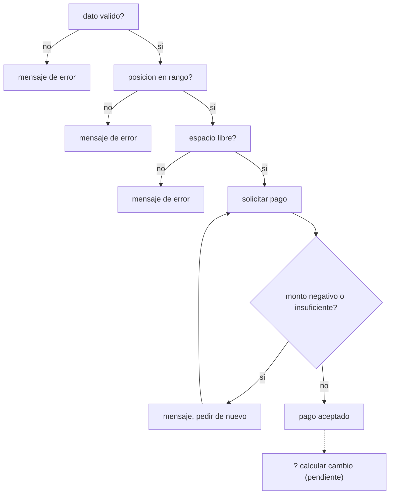

# 05. Validaciones y cobro

Antes de aceptar una operación (registrar un dato, cobrar un servicio) casi siempre hay una cadena de
condiciones que deben cumplirse **en orden**, y recién al final entra en juego el cobro en sí. Este módulo
practica esas dos ideas por separado: encadenar validaciones, y pedir un pago hasta que sea válido.

Se relaciona con la sección **2.2 Ingreso de vehículo, pago y cambio** de la rúbrica.

## El flujo completo



## Encadenar validaciones con `if / else if`

```java
if (!datoValido) {
    // ...
} else if (!posicionEnRango) {
    // ...
} else if (!espacioLibre) {
    // ...
} else {
    // solo llega aqui si TODO lo anterior paso
}
```

El orden importa: cada `else if` solo se evalúa si el anterior fue falso, de la validación más básica a la
más específica. No tendría sentido revisar si un espacio está ocupado antes de confirmar que la posición
es válida — estarías consultando algo que ni siquiera existe. El `else` final es el único lugar donde se
cobra, precisamente porque ahí ya se garantiza que todo lo anterior pasó.

## Cobro con reintento: `do-while` + condición de rechazo

```java
do {
    montoEntregado = teclado.nextDouble();
    // ...
} while (montoEntregado < 0 || montoEntregado < TARIFA);
```

La condición del `while` es la de **seguir pidiendo** (monto negativo o insuficiente), no la de aceptar.
Cuando el ciclo termina, `montoEntregado` ya es válido — esa garantía es la que te permite operar con ese
valor justo después sin tener que revisarlo de nuevo.

## Lo que este ejemplo deja pendiente

El código recibe un pago válido y lo confirma, pero **no calcula el cambio** — queda como ejercicio: una
vez que `montoEntregado >= TARIFA` está garantizado, ¿qué operación te da el cambio? El comentario dentro
de [`ValidacionesYCobro.java`](src/main/java/gt/edu/usac/ipc1/pagos/ValidacionesYCobro.java) marca
exactamente dónde agregarlo.

### Cómo correrlo en NetBeans

1. `File > Open Project…` sobre la carpeta `05_validaciones_y_cobro`.
2. Abrí `ValidacionesYCobro.java` y `Shift+F6`. Probá un monto negativo, uno menor a Q10, uno exacto y uno
   mayor, para ver las distintas reacciones.

En tu solución real, las banderas de validación salen de tus propios métodos (formato del dato, rango de
posición, disponibilidad del espacio) — este módulo solo muestra cómo se combinan una vez que ya las
tenés.
