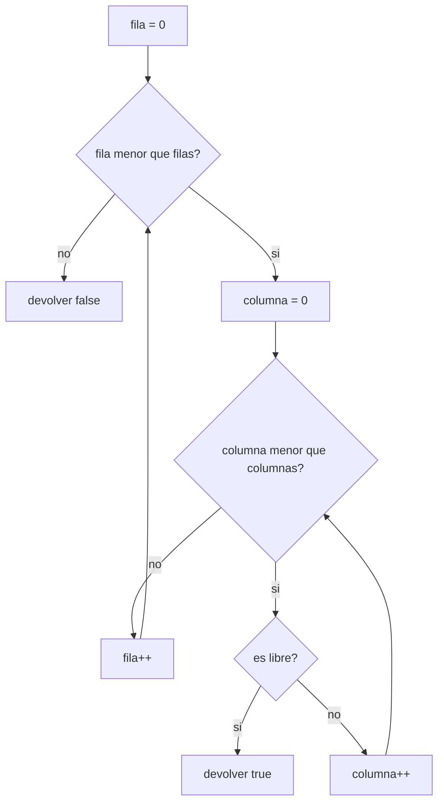

# 06. Recorrido de matrices

Antes de imprimir un tablero completo o llevar la cuenta de espacios, hace falta el bloque más básico:
recorrer una matriz para responder una pregunta puntual sobre su contenido — por ejemplo, si una posición
específica está libre, o si existe al menos un espacio disponible en toda la estructura.

Se relaciona con la sección **2.4 Visualización del estacionamiento** de la rúbrica, en la parte de
distinguir correctamente espacios libres de ocupados.

## Verificar una posición puntual

```java
static boolean esPosicionLibre(char[][] espacios, int fila, int columna) {
    return espacios[fila][columna] == LIBRE;
}
```

Cuando ya sabés exactamente qué celda te interesa, no hace falta ningún ciclo: es un acceso directo con
dos índices, comparado contra el valor que representa "libre".

## Verificar si existe al menos un espacio libre, con salida anticipada



Cuando la pregunta es más general ("¿hay *algún* espacio libre en toda la matriz?"), sí hace falta
recorrer — pero el recorrido no tiene que ser completo: apenas se encuentra la primera celda libre, se
puede devolver `true` de inmediato sin revisar el resto. Es el mismo principio de salida anticipada que ya
viste en la búsqueda lineal del módulo [`04_busqueda_en_arreglos`](../04_busqueda_en_arreglos/), aplicado
ahora sobre dos dimensiones en vez de una.

## Lo que este ejemplo deja pendiente

[`VerificacionDeDisponibilidad.java`](src/main/java/gt/edu/usac/ipc1/matrices/VerificacionDeDisponibilidad.java)
se queda únicamente en la verificación de disponibilidad. Construir sobre esta base la impresión completa
del tablero (con encabezados de fila/columna) o los acumuladores de "cuántos libres, cuántos ocupados"
(sumando mientras se recorre, en vez de solo cortar en el primero) queda como ejercicio — usá el recorrido
anidado del módulo [`01_arreglos_bidimensionales_del_tablero`](../01_arreglos_bidimensionales_del_tablero/)
como punto de partida para esa parte.

### Cómo correrlo en NetBeans

1. `File > Open Project…` sobre la carpeta `06_recorrido_de_matrices`.
2. Abrí `VerificacionDeDisponibilidad.java` y `Shift+F6`.
