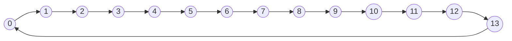

# 07. Cálculo de rutas

"Mostrar ruta más corta entre entrada y salida" pide comparar dos recorridos posibles alrededor del
perímetro (sentido horario y antihorario) y recomendar el más corto. La parte conceptual difícil no es la
comparación en sí, sino cómo representar "el perímetro" de una forma que se pueda medir.

Corresponde a la sección **2.6 Ruta más corta entre entrada y salida** de la rúbrica (*"Calcula las
distancias por sentido horario y antihorario... también maneja correctamente un empate"*).

## El perímetro como un ciclo



Cada nodo es una posición del borde, numerada en el orden en que `construirPerimetro` la agrega (sentido
horario). La distancia horaria entre dos nodos es cuánto hay que avanzar siguiendo las flechas; la
antihoraria es recorrerlo en el sentido contrario.

## La idea central: el perímetro es una secuencia, no una cuadrícula

En vez de pensar en "filas y columnas" para calcular la ruta, conviene pensar el borde como una lista
ordenada de posiciones, dando la vuelta completa una sola vez: la posición `0` es una esquina, la `1` es la
siguiente casilla en sentido horario, y así hasta volver casi al punto de partida. Una vez que el borde es
una secuencia, la "distancia entre dos puntos" se convierte en una simple diferencia de índices — el mismo
tipo de problema que calcular cuántos números hay entre la posición 3 y la posición 9 de un arreglo.

```java
int[] filaPerimetro = new int[TOTAL_PERIMETRO];
int[] columnaPerimetro = new int[TOTAL_PERIMETRO];
```

Se usan dos arreglos paralelos (mismo patrón del módulo [`04_busqueda_en_arreglos`](../04_busqueda_en_arreglos/)):
la posición `i` de ambos arreglos juntos forman una coordenada `(fila, columna)` del perímetro.

## Construir la secuencia en 4 tramos

El perímetro se arma recorriendo los 4 lados del rectángulo, cada uno arrancando justo donde terminó el
anterior (sin repetir la esquina compartida):

1. Borde superior, de izquierda a derecha.
2. Borde derecho, de arriba hacia abajo (empieza en fila `1`, porque la fila `0` ya se agregó en el paso 1).
3. Borde inferior, de derecha a izquierda (empieza en la penúltima columna, porque la última ya se agregó
   en el paso 2).
4. Borde izquierdo, de abajo hacia arriba (sin repetir ninguna de las esquinas ya agregadas).

El total de posiciones de un perímetro rectangular es `2*FILAS + 2*COLUMNAS - 4` — las 4 esquinas se
cuentan una sola vez cada una en vez de dos.

## Ubicar entrada y salida dentro de la secuencia

```java
int indiceEntrada = buscarIndiceEnPerimetro(filaPerimetro, columnaPerimetro, filaEntrada, columnaEntrada);
int indiceSalida = buscarIndiceEnPerimetro(filaPerimetro, columnaPerimetro, filaSalida, columnaSalida);
```

Es la misma búsqueda lineal del módulo 04, aplicada sobre los arreglos del perímetro en vez de sobre
placas. Una vez que tenés el **índice** de la entrada y el de la salida dentro de esa secuencia, calcular
la distancia ya no depende de filas ni columnas — es aritmética sobre esos dos números.

## Distancia con aritmética modular

```java
int distanciaHoraria = (indiceSalida - indiceEntrada + total) % total;
int distanciaAntihoraria = (indiceEntrada - indiceSalida + total) % total;
```

`% total` (el operador módulo) hace que el resultado "dé la vuelta" cuando se pasa del final del arreglo,
igual que un reloj vuelve a las 12 después de la 1. El `+ total` antes del módulo es un truco necesario
porque en Java el resto de un número negativo puede salir negativo (`-3 % 14` da `-3`, no `11`); sumar
`total` antes garantiza que el valor de entrada al `%` sea positivo.

Fijate que `distanciaHoraria + distanciaAntihoraria` siempre da exactamente `total`: dar la vuelta completa
por un lado o por el otro recorre el mismo perímetro entero. Esa relación es una buena forma de verificar
que el cálculo está bien hecho.

## El empate

```java
if (distanciaHoraria < distanciaAntihoraria) {
    // ...
} else if (distanciaAntihoraria < distanciaHoraria) {
    // ...
} else {
    System.out.println("Ambas rutas tienen la misma distancia, cualquiera puede utilizarse.");
}
```

Como las dos distancias siempre suman `total`, solo pueden ser iguales cuando `total` es par y la entrada
y la salida están exactamente a mitad de camino una de la otra. El enunciado pide explícitamente manejar
ese caso, así que el `else` final no es opcional.

## Ejemplo ejecutable

[`CalculoDeRutas.java`](src/main/java/gt/edu/usac/ipc1/rutas/CalculoDeRutas.java) construye el perímetro
de un rectángulo 4x5 de ejemplo y calcula la ruta más corta entre dos posiciones fijas sobre ese borde.

### Cómo correrlo en NetBeans

1. `File > Open Project…` sobre la carpeta `07_calculo_de_rutas`.
2. Abrí `CalculoDeRutas.java` y `Shift+F6`. Cambiá `filaEntrada`/`columnaEntrada` y
   `filaSalida`/`columnaSalida` por otras posiciones del perímetro (incluyendo una combinación que dé
   empate) para ver cómo cambia el resultado.

Para tu tablero real, `FILAS` y `COLUMNAS` cambian a los del enunciado, y la entrada/salida ya no están
fijas sino que vienen del módulo [`03_generacion_aleatoria`](../03_generacion_aleatoria/).
