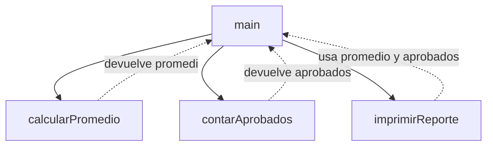

# 08. Métodos y modularización

Este es el módulo que cierra la guía: no enseña un concepto nuevo del estacionamiento, sino cómo *unir*
todo lo anterior sin terminar con un `main` de 300 líneas. La rúbrica lo pondera directo:
**1.2 Calidad de código** vale 10 puntos y depende explícitamente de que "el código esté dividido en
métodos... evita repetición... no se acepta una solución desarrollada completamente dentro del método
`main`".

## `main` como orquestador



## El mismo problema, de dos formas

**Todo en `main`** (lo que el enunciado no acepta — este bloque es solo ilustrativo, no forma parte del
proyecto):

```java
public static void main(String[] args) {
    int[] notas = {65, 90, 45, 78, 88, 30, 100};

    int suma = 0;
    for (int nota : notas) {
        suma += nota;
    }
    double promedio = (double) suma / notas.length;

    int aprobados = 0;
    for (int nota : notas) {
        if (nota >= 61) {
            aprobados++;
        }
    }

    System.out.println("Promedio: " + promedio);
    System.out.println("Aprobados: " + aprobados);
    // ... y así, todo mezclado en un solo bloque cada vez más largo
}
```

**Dividido en métodos** (el patrón que sí pide la práctica):

```java
public static void main(String[] args) {
    int[] notas = {65, 90, 45, 78, 88, 30, 100};

    double promedio = calcularPromedio(notas);
    int aprobados = contarAprobados(notas, 61);

    imprimirReporte(notas, promedio, aprobados);
}
```

El segundo `main` se lee de corrido, sin distraerse en el *cómo* de cada cálculo — cada nombre de método ya
dice qué hace. Eso es "legibilidad", uno de los criterios explícitos de la rúbrica.

## Tres preguntas para diseñar cada método

1. **¿Qué necesita saber para hacer su trabajo?** Eso son los **parámetros**. `contarAprobados(notas,
   notaMinima)` recibe el arreglo y el mínimo para aprobar — no asume un `61` fijo adentro, así que el
   mismo método serviría con cualquier otro criterio con solo cambiar lo que se le manda.
2. **¿Necesita devolver un resultado, o solo producir un efecto?** Si devuelve algo, su tipo de retorno no
   es `void` (`calcularPromedio` devuelve `double`). Si solo imprime o modifica algo sin necesidad de
   entregar un valor de vuelta, es `void` (`imprimirReporte`).
3. **¿Necesita modificar los datos originales, o solo leerlos?** Como los arreglos se pasan por
   referencia (visto en el módulo [`01_arreglos_bidimensionales_del_tablero`](../01_arreglos_bidimensionales_del_tablero/)),
   un método que recibe un arreglo puede modificarlo directamente sin devolverlo — pero si solo necesita
   *leerlo* (como `calcularPromedio`), es buena práctica no tocarlo, para que quien llama al método no se
   lleve sorpresas.

## `void` vs. con retorno, de un vistazo

| | Ejemplo | Se usa cuando... |
|---|---|---|
| Con retorno | `static double calcularPromedio(int[] notas)` | el resultado hace falta después, para otro cálculo o para decidir algo |
| `void` | `static void imprimirReporte(...)` | el método ya termina su trabajo por sí mismo (imprimir, modificar un arreglo recibido) |

## Cómo se conecta con el resto de la guía

El módulo [`00_construyendo_el_menu`](../00_construyendo_el_menu/) dejó cada `case` del `switch` con un
mensaje de marcador de posición (`"-> Aquí iría la lógica..."`). Ese es exactamente el lugar donde, en tu
solución, cada `case` debería llamar a un método propio construido siguiendo este mismo patrón — por
ejemplo `case 1: ingresarVehiculo(tablero, placas, ...); break;` — en vez de escribir la lógica completa
ahí adentro. Cada uno de los módulos 01 a 07 de esta guía es, en la práctica, el contenido de uno de esos
métodos.

## Ejemplo ejecutable

[`MetodosYModularizacion.java`](src/main/java/gt/edu/usac/ipc1/metodos/MetodosYModularizacion.java)
implementa la versión "dividida en métodos" de arriba: un `main` que solo orquesta, y tres métodos con
una única responsabilidad cada uno.

### Cómo correrlo en NetBeans

1. `File > Open Project…` sobre la carpeta `08_metodos_y_modularizacion`.
2. Abrí `MetodosYModularizacion.java` y `Shift+F6`.

Con esto se completan los 9 módulos de la guía — el siguiente paso es integrar cada pieza en tu propio
proyecto de la Práctica 1, no en estas carpetas de ejemplo.
